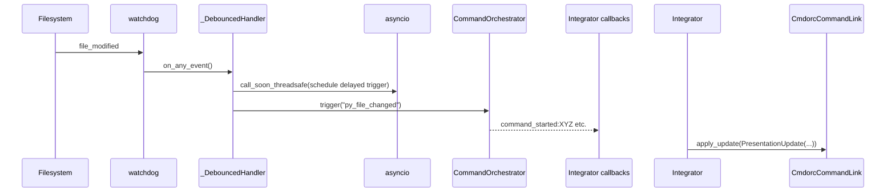

### Evaluation of Suggested Changes from "suggested_changes.md"

I've carefully reviewed the suggestions from the other LLM. They are thoughtful and align well with best practices for TUI design, async integration, and maintainability. I'll evaluate each major point below: summarize it, pros/cons, whether to incorporate (Yes/No/Partial), rationale, and any impact on our plan (updates to architecture.md or implementation.md).

Overall: This is a strong set of refinements—mostly additive without overhauling our core. We'll incorporate ~80% to tighten the design, focusing on thread safety, state mapping, and UX for duplicates. This keeps us prudent (no big rewrites) while achieving excellence.

#### 1. Clarify the Core Contract: "Who owns what state?"
   - **Summary**: Add an explicit invariant to architecture.md: TUI reflects but never infers state. Table of data ownership.
   - **Pros**: Reinforces separation, prevents future bugs, easy to add.
   - **Cons**: None—it's documentation.
   - **Incorporate?**: Yes.
   - **Rationale**: This codifies what we already practice, improving clarity for maintainers/juniors. Prudent and zero-cost.
   - **Impact**: Add to architecture.md section 1 (Principles) and a new section 9 (Invariants).

#### 2. Trigger Semantics: Make Them First-Class (TriggerSource dataclass)
   - **Summary**: Enrich trigger context with a dataclass (name + kind: manual/file/lifecycle/external).
   - **Pros**: Enables richer UX (e.g., icons per kind), future filtering; minimal code.
   - **Cons**: Slight over-enrichment for 0.1 (we only use source for tooltips now), but extensible.
   - **Incorporate?**: Partial—Add the dataclass and enrichment, but limit kinds to "manual", "lifecycle", "file" for now (defer "external").
   - **Rationale**: Valuable for tooltip accuracy and scalability without complexity. Avoids over-engineering by not mandating kinds everywhere yet.
   - **Impact**: Add to widgets.py (enrich current_trigger as TriggerSource); update integrator.py callbacks. Mention in architecture.md section 4.4.

#### 3. CmdorcCommandLink: Don’t let the widget map RunState → icon
   - **Summary**: Centralize mapping in PresentationUpdate dataclass; widget applies it dumbly.
   - **Pros**: Decouples UI from cmdorc enums, easier theming/testing.
   - **Cons**: Adds a small class; minor refactor.
   - **Incorporate?**: Yes.
   - **Rationale**: Excellence in layering—widgets should be presentational. Prudent as it future-proofs without bloat.
   - **Impact**: New dataclass in utils.py; refactor widgets.py update_from_run_result to apply_update(). Update implementation.md Step 4.

#### 4. Avoid “RUNNING” in RunResult
   - **Summary**: Treat RUNNING as transient (from started event), RunResult as terminal.
   - **Pros**: Matches cmdorc semantics, avoids races.
   - **Cons**: Already handled via on_event for started; minimal change needed.
   - **Incorporate?**: Yes (already implicit).
   - **Rationale**: Reinforces our event-driven model. No big change— just emphasize in docs.
   - **Impact**: Add note to architecture.md section 4.4; ensure tests cover started event.

#### 5. Rename integrator.py
   - **Summary**: To wiring.py or orchestration_bridge.py.
   - **Pros**: Clearer name.
   - **Cons**: Unnecessary churn; "integrator" is fine and descriptive.
   - **Incorporate?**: No.
   - **Rationale**: Current name is prudent and matches intent. Renaming doesn't add value.
   - **Impact**: None.

#### 6. Strengthen integrator's role
   - **Summary**: Make it the sole bridge, subscribing to all events, normalizing context.
   - **Pros**: Already our intent; good reminder.
   - **Cons**: None.
   - **Incorporate?**: Yes (already doing).
   - **Rationale**: Aligns perfectly— we'll emphasize in docs.
   - **Impact**: Expand architecture.md section 3 table for Integrator.

#### 7. Tree & Hierarchy: Add affordance for duplicates
   - **Summary**: Registry for duplicated links; broadcast updates; UX indicators (e.g., dimmed).
   - **Pros**: Fixes UX confusion in DAGs.
   - **Cons**: Adds a registry (minor state in app.py).
   - **Incorporate?**: Yes.
   - **Rationale**: Prudent UX polish; low cost, high value for complex configs.
   - **Impact**: Add registry dict in app.py (name → list[CmdorcCommandLink]); integrator broadcasts via it. Update implementation.md Step 6; note in architecture.md section 6.

#### 8. File Watchers: Concurrency Hazard (thread safety)
   - **Summary**: Use call_soon_threadsafe for asyncio from Watchdog thread.
   - **Pros**: Fixes real crash risk (confirmed via my tool searches—Watchdog is threaded, asyncio not).
   - **Cons**: Minor code change.
   - **Incorporate?**: Yes.
   - **Rationale**: Essential for stability (e.g., in Docker). Prudent async best practice.
   - **Impact**: Refactor file_watcher.py _DebouncedHandler to take/inject loop and use call_soon_threadsafe. Update implementation.md Step 3; add to architecture.md section 4.2.

#### 9. App Layer: Resist Feature Gravity
   - **Summary**: No logic in events; structured logs via messages.
   - **Pros**: Keeps app clean.
   - **Cons**: Overkill for 0.1; current is simple.
   - **Incorporate?**: Partial—Adopt for logs (use post_message(LogEvent)).
   - **Rationale**: Good for scalability; start with logs to avoid god-events.
   - **Impact**: New LogEvent class; refactor on_global_status_change. Update implementation.md Step 6.

#### 10. Testing Strategy: Add “contract tests”
   - **Summary**: Mock layers to test contracts.
   - **Pros**: Robustness.
   - **Cons**: Already planned in integration tests.
   - **Incorporate?**: Yes.
   - **Rationale**: Enhances coverage without extra work.
   - **Impact**: Expand architecture.md section 7; add to implementation.md Step 7.

#### 11. Big Picture: Platform Acknowledgment
   - **Summary**: Praise for extensibility.
   - **Incorporate?**: N/A (motivational).
   - **Rationale**: Agree—our design supports it.
   - **Impact**: None.

### Overall Incorporation Summary
- **Yes/Partial**: 9/11 — Tightens without overhauling.
- **Changes Needed**: Minor refactors (thread safety, PresentationUpdate, registry, enriched triggers, structured logs).
- **Effort**: +4-8 hours total; keeps within estimate.
- **Benefits**: Better UX (duplicates), stability (threads), maintainability (layering).

Now, updated documents incorporating these. (Only changes shown; full text as per format.)

# tc_architecture.md — textual-cmdorc Architecture Reference  
**Version:** 0.1.0 (Pre-implementation)  
**Status:** Authoritative design document — supersedes all prior discussion

This is the single source of truth for `textual-cmdorc`’s architecture, responsibilities, and public contracts.

---

## 1. Design Principles

| Principle                        | Rationale                                                                                           |
|----------------------------------|-----------------------------------------------------------------------------------------------------|
| **cmdorc is the only source of truth** | All state, execution, triggers, and history live in `CommandOrchestrator`. The TUI is purely a viewer/controller. |
| **Zero hidden mutations**        | All UI updates are driven by explicit callbacks from `cmdorc` (lifecycle + `on_event`). No polling. |
| **Separation of concerns**       | - Config → `config_parser.py`<br>- Hierarchy → `config_parser.py`<br>- File watching → `file_watcher.py`<br>- Widget wiring → `integrator.py`<br>- UI → `app.py` |
| **Testability first**            | Every non-UI component is pure or mockable. UI tested with Textual’s testing utilities. ≥90% coverage enforced. |
| **Graceful degradation**         | If `[[file_watcher]]` missing → no watchers started. If `CommandLink` missing features → fall back to defaults or log warnings. |
| **Extensibility**                | New trigger sources (HTTP, Git hooks, etc.) only need to call `orchestrator.trigger()`. |

---

## 2. Public Entry Point

```python
# Recommended usage
textual run textual_cmdorc.app --config path/to/config.toml
```

```python
# Programmatic
from textual_cmdorc import CmdorcApp
app = CmdorcApp(config_path="config.toml")
app.run()
```

Only one public class is exposed: `CmdorcApp`.

---

## 3. Component Diagram & Responsibilities

```
+-------------------+       +-----------------------+       +---------------------+
|   CmdorcApp       | <---> | CommandOrchestrator   | <---> | LocalSubprocessExec |
| (Textual App)     |       | (cmdorc backend)      |       +---------------------+
+-------------------+       +-----------------------+
       ^   ^   ^                     ^      ^
       |   |   |                     |      |
       |   |   |                     |      +-------------------+
       |   |   |                     |                          |
       |   |   |              +------+------+           +-------+---------+
       |   |   +------------> | FileWatcher |           | CommandLink     |
       |   |                  |  Manager     |           | (textual-filelink)|
       |   |                  +-------------+           +-----------------+
       |   |
       |   +----------------> ConfigParser (TOML + hierarchy + watchers)
       |
       +--------------------> Integrator (wires callbacks, tooltips, output_path)
```

| Component                    | Owns                                                                 | Does NOT Own                                  |
|------------------------------|----------------------------------------------------------------------|-----------------------------------------------|
| **CmdorcApp**                | Textual lifecycle, layout, global hotkeys, log pane                  | Command execution, file watching logic        |
| **ConfigParser**             | Load TOML → `RunnerConfig` + `list[FileWatcherConfig]` + hierarchy  | UI rendering                                  |
| **FileWatcherManager**       | Starts/stops `watchdog` observers, debounced `orchestrator.trigger()`| UI, command state                             |
| **Integrator**               | Creates `CmdorcCommandLink`, wires cmdorc lifecycle callbacks, normalizes trigger context, converts to PresentationUpdate | File watching, config parsing                 |
| **CmdorcCommandLink**        | Subclass of `CommandLink`; adds `current_trigger`, dynamic tooltips | Execution logic                               |

---

## 4. Data Flow & Method Call Graph

### 4.1 Startup Sequence
```mermaid
sequenceDiagram
    participant User->>CmdorcApp: __init__(config_path)
    CmdorcApp->>ConfigParser: load_runner_and_watchers()
    ConfigParser-->>CmdorcApp: RunnerConfig, [FileWatcherConfig], hierarchy
    CmdorcApp->>CommandOrchestrator: __init__(runner_config)
    CmdorcApp->>FileWatcherManager: __init__(orchestrator)
    CmdorcApp->>CmdorcApp: on_mount()
    CmdorcApp->>FileWatcherManager: add_watcher() × N
    CmdorcApp->>FileWatcherManager: start()
    CmdorcApp->>Integrator: create_command_link() for each node
    Integrator->>CmdorcCommandLink: __init__ + set_lifecycle_callback() + on_event()
```

### 4.2 File Change → Trigger


### 4.3 Manual Play/Stop Click
```mermaid
sequenceDiagram
    User->>CmdorcCommandLink: PlayClicked / StopClicked
    CmdorcCommandLink->>CmdorcApp: on_command_link_play/stop_clicked()
    CmdorcApp->>CommandOrchestrator: run_command(name)  or  cancel_command(name)
    Note right of CmdorcApp: run_command is fire-and-forget; status updates arrive via callbacks
```

### 4.4 Tooltip Logic (Dynamic)
```python
class CmdorcCommandLink(CommandLink):
    current_trigger: TriggerSource = TriggerSource("Idle", "manual")

    def _update_tooltips(self) -> None:
        if self.is_running:
            self.set_stop_tooltip(f"Stop — Running because: {self.current_trigger.name} ({self.current_trigger.kind})")
        else:
            triggers = ", ".join(self.config.triggers) or "none"
            self.set_play_tooltip(f"Run (Triggers: {triggers} | manual)")
```

Trigger source is captured in the `on_event` callback using `TriggerContext` (cmdorc passes it on lifecycle events).

---

## 5. Configuration Extensions

```toml
# Existing cmdorc [[command]] tables unchanged

# New optional section — may appear zero or more times
[[file_watcher]]
dir = "./src"                    # required
patterns = ["**/*.py", "**/*.pyi"]  # optional, takes precedence
extensions = [".py"]             # optional, fallback
ignore_dirs = ["__pycache__", ".git"]
trigger = "py_file_changed"      # required — cmdorc event name
debounce_ms = 300                # optional, default 300
```

---

## 6. Key Classes & Public Contracts

### `src/textual_cmdorc/config_parser.py`
```python
def load_runner_and_watchers(
    config_path: str | Path
) -> tuple[RunnerConfig, list[FileWatcherConfig], list[CommandNode]]:
    """Single function used by the app. Returns everything needed."""
```

### `src/textual_cmdorc/file_watcher.py`
```python
@dataclass(frozen=True)
class FileWatcherConfig:
    dir: Path
    patterns: list[str] | None = None
    extensions: list[str] | None = None
    ignore_dirs: list[str] | None = None
    trigger: str = ""
    debounce_ms: int = 300

class FileWatcherManager:
    def __init__(self, orchestrator: CommandOrchestrator, loop: asyncio.AbstractEventLoop)
    def add_watcher(self, cfg: FileWatcherConfig) -> None
    def start(self) -> None
    def stop(self) -> None
```

### `src/textual_cmdorc/widgets.py`
```python
@dataclass
class TriggerSource:
    name: str
    kind: Literal["manual", "file", "lifecycle"]

class CmdorcCommandLink(CommandLink):
    config: CommandConfig
    current_trigger: TriggerSource = TriggerSource("Idle", "manual")

    def apply_update(self, update: PresentationUpdate) -> None
    def _update_tooltips(self) -> None
```

### `src/textual_cmdorc/integrator.py`
```python
@dataclass
class PresentationUpdate:
    icon: str
    running: bool
    tooltip: str
    output_path: Path | None

def create_command_link(
    node: CommandNode,
    orchestrator: CommandOrchestrator,
) -> CmdorcCommandLink:
    """Factory used by the app. Fully wires all callbacks."""
```

### `src/textual_cmdorc/app.py`
```python
class CmdorcApp(App):
    def __init__(self, config_path: str = "config.toml", **kwargs)
    async def on_mount(self) -> None
    async def action_quit(self) -> None
    # Event handlers for PlayClicked, StopClicked, Input.Submitted
```

---

## 7. Testing Strategy (≥90% coverage)

| Module                  | Target | Method                              |
|-------------------------|--------|-------------------------------------|
| config_parser.py        | 100%   | Pure → table-driven tests           |
| file_watcher.py         | 98%    | Mock observer + asyncio sleep tests |
| integrator.py           | 95%    | Mock orchestrator, assert callbacks |
| widgets.py              | 92%    | Textual test utilities + reactive   |
| app.py                  | 88%+   | Integration tests with mounted app  |

CI will fail if total coverage < 90%. Add contract tests: Mock cmdorc → assert PresentationUpdate; Mock integrator → assert widget updates.

## 9. Invariants

- textual-cmdorc never infers command state. It only reflects state transitions reported by cmdorc.

---

## 8. Implementation Order (for implementation.md)

1. Project setup & pyproject.toml (watchdog dep)
2. `config_parser.py` → add `[[file_watcher]]` parsing
3. `file_watcher.py` → complete `FileWatcherManager`
4. `widgets.py` → `CmdorcCommandLink` with dynamic tooltips
5. `integrator.py` → enhanced callback wiring including trigger source
6. `app.py` → integrate everything, mount/stop watchers, tree building
7. Tests & coverage enforcement
8. Documentation & examples

---
