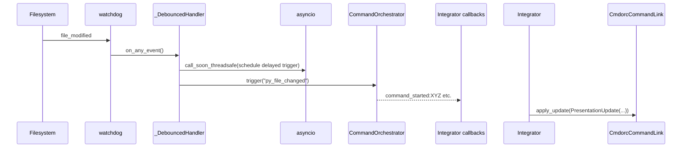

# tc_architecture.md — textual-cmdorc Architecture Reference  
**Version:** 0.1.0 (Pre-implementation)  
**Status:** Authoritative design document — supersedes all prior discussion

This is the single source of truth for `textual-cmdorc`’s architecture, responsibilities, and public contracts.

---

## 1. Design Principles

| Principle                        | Rationale                                                                                           |
|----------------------------------|-----------------------------------------------------------------------------------------------------|
| **Embeddable by default**        | Architecture splits into non-Textual Controller (orchestration logic) and passive Textual View (rendering). Enables both standalone TUI mode and embedding in larger host applications. |
| **cmdorc is the only source of truth** | All state, execution, triggers, and history live in `CommandOrchestrator`. The TUI is purely a viewer/controller. |
| **Zero hidden mutations**        | All UI updates are driven by explicit callbacks from `cmdorc` (lifecycle + `on_event`). No polling. |
| **Separation of concerns**       | - Config → `cmdorc_frontend/config.py`<br>- Hierarchy → `cmdorc_frontend/config.py`<br>- File watching → `textual_cmdorc/file_watcher.py` (concrete) + `cmdorc_frontend/watchers.py` (abstract)<br>- Controller logic → `textual_cmdorc/controller.py`<br>- Widget rendering → `textual_cmdorc/view.py` + `textual_cmdorc/widgets.py`<br>- App composition → `textual_cmdorc/app.py` |
| **Testability first**            | Every non-UI component is pure or mockable. UI tested with Textual's testing utilities. ≥90% coverage enforced. |
| **Graceful degradation**         | If `[[file_watcher]]` missing → no watchers started. If `CommandLink` missing features → fall back to defaults or log warnings. |
| **Extensibility**                | New trigger sources (HTTP, Git hooks, etc.) only need to call `orchestrator.trigger()`. |

---

## 2. Public Entry Point

### Standalone Mode (Traditional TUI)

```bash
# CLI usage
textual run textual_cmdorc.app --config path/to/config.toml

# Or initialize config first
cmdorc init config.toml  # Generates config with [keyboard] placeholders
```

```python
# Programmatic usage
from textual_cmdorc import CmdorcApp
app = CmdorcApp(config_path="config.toml")
app.run()
```

### Embedding Mode (In Larger TUI)

```python
from textual_cmdorc import CmdorcController, CmdorcView
from textual.app import App
from textual.containers import Horizontal

class MyLargerTUI(App):
    def compose(self):
        # Host creates controller (non-Textual, reusable)
        self.cmdorc_controller = CmdorcController("config.toml", enable_watchers=False)

        # Wire controller events to host app
        self.cmdorc_controller.on_command_finished = self.on_cmdorc_command_done

        # CmdorcView is a passive widget
        yield Horizontal(
            CmdorcView(self.cmdorc_controller, show_log_pane=False),
            MyOtherPanel(),
        )

    def on_mount(self):
        # Host controls lifecycle
        self.cmdorc_controller.attach(asyncio.get_running_loop())
```

Public classes exposed:
- **`CmdorcApp`** - Thin shell for standalone mode (composes Controller + View)
- **`CmdorcController`** - Non-Textual orchestration logic (primary embed point)
- **`CmdorcView`** - Passive Textual widget for rendering

---

## 3. Three-Layer Embeddable Architecture

### Layer Diagram

```
┌─────────────────────────────────────────────────────────┐
│  CmdorcApp (Textual App) - STANDALONE MODE ONLY        │
│  - Thin shell composing Controller + View               │
│  - Owns process, event loop, global keyboard shortcuts  │
└─────────────────────────────────────────────────────────┘
                      │ composes
                      ▼
┌─────────────────────────────────────────────────────────┐
│  CmdorcView (Textual Widget) - PRIMARY EMBED POINT     │
│  - Renders command tree, log pane                       │
│  - Receives CmdorcController instance                   │
│  - Passive: doesn't bind global keys or manage lifecycle│
└─────────────────────────────────────────────────────────┘
                      │ consumes
                      ▼
┌─────────────────────────────────────────────────────────┐
│  CmdorcController (Non-Textual) - SECONDARY EMBED POINT│
│  - Owns CommandOrchestrator, FileWatcherManager         │
│  - Loads config, builds hierarchy, manages state        │
│  - Exposes keyboard_bindings metadata (no actual keys)  │
│  - Exposes outbound event callbacks                     │
│  - Pluggable CmdorcNotifier for logging                │
└─────────────────────────────────────────────────────────┘
```

### Responsibilities Table

| Component                    | Owns                                                                 | Does NOT Own                                  |
|------------------------------|----------------------------------------------------------------------|-----------------------------------------------|
| **CmdorcApp** (Layer 1)      | Textual App lifecycle, global keyboard bindings, app-level actions   | Command execution, state, file watching       |
| **CmdorcView** (Layer 2)     | Tree rendering, log pane, widget layout, keyboard metadata display  | State management, keyboard event handling, watchers |
| **CmdorcController** (Layer 3) | CommandOrchestrator, FileWatcherManager, config parsing, hierarchy  | Textual/UI rendering, lifecycle management    |
| **ConfigParser**             | Load TOML → `RunnerConfig` + `KeyboardConfig` + `list[WatcherConfig]` + hierarchy  | UI rendering                                  |
| **FileWatcherManager**       | Starts/stops `watchdog` observers, debounced `orchestrator.trigger()`| UI, command state                             |
| **Integrator**               | Creates `CmdorcCommandLink`, wires orchestrator callbacks            | File watching, config parsing, UI events      |
| **CmdorcCommandLink**        | Subclass of `CommandLink`; adds trigger chain, tooltips, indicators | Execution logic, state management             |

---

## 4. Data Flow & Method Call Graph

### 4.1 Standalone Startup Sequence (CmdorcApp Mode)
```
User
  └──> CmdorcApp.__init__(config_path)
         ├──> CmdorcController.__init__(config_path, enable_watchers=True)
         │     ├──> ConfigParser.load_frontend_config() → RunnerConfig, KeyboardConfig, hierarchy
         │     ├──> CommandOrchestrator.__init__(runner_config)
         │     └──> FileWatcherManager.__init__(orchestrator)
         │
         └──> on_mount()
               ├──> CmdorcView(controller, show_log_pane=True)
               │     └──> Integrator.create_command_link() × N → CmdorcCommandLink tree
               │
               ├──> controller.attach(asyncio.get_running_loop())
               │     ├──> FileWatcherManager.add_watcher() × N
               │     └──> FileWatcherManager.start()
               │
               └──> Bind global keyboard shortcuts (from controller.keyboard_bindings)
```

### 4.1b Embedding Lifecycle Sequence (CmdorcView in Host App)
```
Host Application
  └──> MyLargerTUI.compose()
         ├──> controller = CmdorcController(config_path, enable_watchers=False)
         │     ├──> ConfigParser.load_frontend_config()
         │     ├──> CommandOrchestrator.__init__()
         │     └──> FileWatcherManager.__init__() [idle, not started]
         │
         └──> yield CmdorcView(controller, enable_local_bindings=False)
               └──> Integrator.create_command_link() × N → CmdorcCommandLink tree

  └──> on_mount()
         ├──> controller.attach(asyncio.get_running_loop())
         │     └──> FileWatcherManager.start() [host decides when to start]
         │
         └──> Wire controller callbacks to host events
               ├──> controller.on_command_started = host.on_cmdorc_command_started
               └──> controller.on_command_finished = host.on_cmdorc_command_finished
```

### 4.2 File Change → Trigger


### 4.3 Manual Play/Stop Click
```mermaid
sequenceDiagram
    User->>CmdorcCommandLink: PlayClicked / StopClicked
    CmdorcCommandLink->>CmdorcApp: on_command_link_play/stop_clicked()
    CmdorcApp->>CommandOrchestrator: run_command(name)  or  cancel_command(name)
    Note right of CmdorcApp: run_command is fire-and-for-get; status updates arrive via callbacks
```

### 4.4 Tooltip Logic with Trigger Chains and Semantic Summaries (Dynamic)

**Feature: Enhanced Tooltips with Human-Readable Trigger Context**

When a command is running, tooltips now show:
1. **Semantic summary** - "Ran automatically (file change)" or "Ran automatically (triggered by another command)"
2. **Full trigger chain** - Technical breadcrumb trail (e.g., "py_file_changed → command_success:Lint")
3. **Keyboard hint** - "[1] to stop" if shortcut configured
4. **Duplicate indicator** - "(This command appears in multiple workflows)" if applicable

```python
class CmdorcCommandLink(CommandLink):
    current_trigger: TriggerSource = TriggerSource("Idle", "manual", chain=[])
    keyboard_shortcut: str | None = None
    is_duplicate: bool = False

    def _update_tooltips(self) -> None:
        if self.is_running:
            # NEW: Show semantic summary first, then technical chain
            semantic = self.current_trigger.get_semantic_summary()
            chain_display = self.current_trigger.format_chain(max_width=80)

            tooltip = f"Stop — {semantic}\n{chain_display}"

            if self.keyboard_shortcut:
                tooltip = f"{tooltip}\n[{self.keyboard_shortcut}] to stop"

            if self.is_duplicate:
                tooltip = f"{tooltip}\n(This command appears in multiple workflows)"

            self.set_stop_tooltip(tooltip)
        else:
            triggers = ", ".join(self.config.triggers) or "none"
            tooltip = f"Run (Triggers: {triggers} | manual)"

            if self.keyboard_shortcut:
                tooltip = f"{tooltip}\n[{self.keyboard_shortcut}] to run"
            else:
                # Show hint for unconfigured shortcuts
                tooltip = f"{tooltip}\nSet hotkey with {self.config.name} = '<key>' in [keyboard] shortcuts"

            if self.is_duplicate:
                tooltip = f"{tooltip}\n(This command appears in multiple workflows)"

            self.set_play_tooltip(tooltip)
```

**TriggerSource helper methods:**

```python
@dataclass
class TriggerSource:
    name: str  # Last trigger in chain (backward compat)
    kind: Literal["manual", "file", "lifecycle"]
    chain: list[str] = field(default_factory=list)  # Full chain from cmdorc

    def get_semantic_summary(self) -> str:
        """Human-readable summary of what triggered execution."""
        if not self.chain:
            return "Ran manually"
        if self.kind == "file":
            return "Ran automatically (file change)"
        elif self.kind == "lifecycle":
            return "Ran automatically (triggered by another command)"
        else:
            return "Ran automatically"

    def format_chain(self, separator: str = " → ", max_width: int = 80) -> str:
        """Format chain for display with left truncation if needed."""
        if not self.chain:
            return "manual"

        full_chain = separator.join(self.chain)

        # Truncate from left if chain is too long
        if max_width and len(full_chain) > max_width:
            keep_chars = max_width - 4  # Reserve 4 for "... "
            if keep_chars > 0:
                return f"...{separator}{full_chain[-keep_chars:]}"

        return full_chain
```

**Example tooltip displays:**

- **Idle (not running):**
  ```
  Run (Triggers: py_file_changed | manual)
  [1] to run
  ```

- **Running from file change:**
  ```
  Stop — Ran automatically (file change)
  py_file_changed
  [1] to stop
  ```

- **Running from lifecycle trigger (long chain):**
  ```
  Stop — Ran automatically (triggered by another command)
  ... → command_success:Lint → command_success:Format
  [2] to stop
  (This command appears in multiple workflows)
  ```

Trigger source is captured via `RunHandle.trigger_chain` from cmdorc and passed through callbacks.
See cmdorc's architecture for details on trigger chain structure.

---

## 5. Configuration Extensions

```toml
# NEW: Global keyboard shortcuts (optional)
[keyboard]
shortcuts = { Lint = "1", Format = "2", Tests = "3", Build = "b" }
enabled = true                   # optional, default true
show_in_tooltips = true          # optional, default true

# File watchers (optional, may appear zero or more times)
[[file_watcher]]
dir = "./src"                    # required
patterns = ["**/*.py", "**/*.pyi"]  # optional, takes precedence
extensions = [".py"]             # optional, fallback
ignore_dirs = ["__pycache__", ".git"]
trigger = "py_file_changed"      # required — cmdorc event name
debounce_ms = 300                # optional, default 300
```

---

## 6. Key Classes & Public Contracts

### `src/textual_cmdorc/controller.py` (NEW - Primary Embed Point)
```python
class CmdorcController:
    """Non-Textual controller for orchestration logic. Primary embed point.

    RECOMMENDATION #2: Stable Public API for v0.1
    ============================================
    The following methods and properties are stable for v0.1:
    - Lifecycle: attach(), detach()
    - Command control: request_run(), request_cancel(), run_command(), cancel_command()
    - Keyboard metadata: keyboard_hints, keyboard_conflicts
    - Outbound events: on_command_started, on_command_finished, on_state_reconciled, etc.
    - Read-only access: orchestrator, hierarchy

    Internal methods (_on_file_change, etc.) may change.
    """

    def __init__(
        self,
        config_path: str | Path,
        notifier: CmdorcNotifier | None = None,
        enable_watchers: bool = True
    ):
        """Initialize controller.

        Args:
            config_path: Path to TOML config
            notifier: Optional notification handler (defaults to NoOpNotifier - silent for embedded mode)
            enable_watchers: If True, watchers auto-start on attach(). If False, host controls lifecycle.
        """

    # Lifecycle
    def attach(self, loop: asyncio.AbstractEventLoop) -> None:
        """Attach to event loop and start watchers if enabled.

        FIX #1: Store loop reference for sync-safe task creation.
        RECOMMENDATION #1: Idempotent - guards against double-attach and non-running loop.
        """

    def detach(self) -> None:
        """Stop watchers and cleanup."""

    # Command control (async)
    async def run_command(self, name: str) -> None:
        """Run a command by name (async)."""

    async def cancel_command(self, name: str) -> None:
        """Cancel a running command (async)."""

    async def reload_config(self) -> None:
        """Reload configuration file."""

    # Command control (sync-safe helpers) - FIX #1
    def request_run(self, name: str) -> None:
        """Request command run (sync-safe, schedules async task).

        FIX #1: Uses stored loop reference instead of asyncio.create_task().
        """

    def request_cancel(self, name: str) -> None:
        """Request command cancellation (sync-safe, schedules async task).

        FIX #1: Uses stored loop reference instead of asyncio.create_task().
        """

    # Keyboard metadata (metadata only, NOT bindings) - POLISH #1
    @property
    def keyboard_hints(self) -> dict[str, str]:
        """Returns {key: command_name} metadata for host to wire.

        POLISH #1: Returns metadata only (no callables) to decouple host from controller internals.
        Host wires own actions: self.bind(key, lambda: controller.request_run(name))
        """

    @property
    def keyboard_conflicts(self) -> dict[str, list[str]]:
        """FIX #3: Returns {key: [cmd_name1, cmd_name2, ...]} for keys with multiple commands.

        Cached in __init__() to avoid recomputation on every access.
        """

    @property
    def keyboard_help(self) -> list[KeyboardHint]:
        """Keyboard shortcut hints for display."""

    # Outbound events (host wires these to its own actions)
    on_command_started: Callable[[str, TriggerSource], None] | None = None
    on_command_finished: Callable[[str, RunResult], None] | None = None
    on_trigger_fired: Callable[[str, str], None] | None = None  # (trigger_name, source)
    on_validation_result: Callable[[ConfigValidationResult], None] | None = None
    on_state_reconciled: Callable[[str, RunState], None] | None = None  # FIX #6: (command_name, state)

    # Intent signals (for actions that affect host)
    on_quit_requested: Callable[[], None] | None = None
    on_cancel_all_requested: Callable[[], None] | None = None

    # Read-only access
    @property
    def orchestrator(self) -> CommandOrchestrator:
        """Direct access for advanced use cases."""

    @property
    def hierarchy(self) -> list[CommandNode]:
        """Command hierarchy for rendering."""

    # Internal threading safety
    def _on_file_change(self, trigger_name: str) -> None:
        """Handle file change events from watcher thread.

        FIX #5: Uses call_soon_threadsafe to schedule async task from watcher thread.
        """
```

### `src/textual_cmdorc/view.py` (NEW - Passive Rendering Widget)
```python
class CmdorcView(Widget):
    """Textual widget for rendering cmdorc command tree. Passive widget suitable for embedding."""

    def __init__(
        self,
        controller: CmdorcController,
        show_log_pane: bool = True,
        enable_local_bindings: bool = False  # For standalone mode only
    ):
        """Initialize view.

        Args:
            controller: CmdorcController instance (non-Textual)
            show_log_pane: Whether to render log pane below tree
            enable_local_bindings: If True, handle keyboard when focused (standalone only)
        """

    # FIX #2: Duplicate tracking
    _command_links: dict[str, list[CmdorcCommandLink]]  # Track all instances per command name

    # View updates driven by controller callbacks
    def refresh_tree(self) -> None:
        """Rebuild tree from controller.hierarchy."""

    def update_command(self, name: str, update: PresentationUpdate) -> None:
        """Update display of specific command."""

    def build_command_tree(self, tree: Tree, nodes: list[CommandNode], parent=None) -> None:
        """Build tree from hierarchy, tracking duplicate command occurrences.

        FIX #2: Detects when commands appear multiple times in tree and marks them.
        """
```

### `src/cmdorc_frontend/notifier.py` (NEW - Pluggable Logging)
```python
class CmdorcNotifier(Protocol):
    """Protocol for pluggable notifications. Implement for custom logging."""

    def info(self, message: str) -> None:
        """Informational message."""

    def warning(self, message: str) -> None:
        """Warning message."""

    def error(self, message: str) -> None:
        """Error message."""

class LoggingNotifier:
    """Default implementation using stdlib logging."""
    def info(self, msg: str) -> None: ...
    def warning(self, msg: str) -> None: ...
    def error(self, msg: str) -> None: ...

class TextualLogPaneNotifier:
    """Textual-specific implementation for standalone mode."""
    def __init__(self, log_pane: Log): ...
    def info(self, msg: str) -> None: ...
    def warning(self, msg: str) -> None: ...
    def error(self, msg: str) -> None: ...
```

### `src/cmdorc_frontend/config.py`
```python
def load_frontend_config(
    config_path: str | Path
) -> tuple[RunnerConfig, KeyboardConfig, list[WatcherConfig], list[CommandNode]]:
    """Single function used by any frontend. Returns everything needed."""

def init_keyboard_config(runner_config: RunnerConfig, output_path: Path | None = None) -> str:
    """Generate initial [keyboard] section with no-op placeholders."""

@dataclass
class KeyboardConfig:
    shortcuts: dict[str, str]  # command_name -> key
    enabled: bool = True
    show_in_tooltips: bool = True
```

### `src/cmdorc_frontend/models.py`
```python
@dataclass
class CommandNode:
    config: CommandConfig
    children: list['CommandNode'] | None = None

@dataclass
class TriggerSource:
    name: str  # Last trigger in chain (backward compat)
    kind: Literal["manual", "file", "lifecycle"]
    chain: list[str]  # Full trigger chain from cmdorc

    @classmethod
    def from_trigger_chain(cls, trigger_chain: list[str]) -> 'TriggerSource':
        """Create from cmdorc's RunHandle.trigger_chain."""

    def get_semantic_summary(self) -> str:
        """Get human-readable summary of trigger source.

        Returns:
            "Ran manually" / "Ran automatically (file change)" / "Ran automatically (triggered by another command)"
        """

    def format_chain(self, separator: str = " → ", max_width: int = 80) -> str:
        """Format chain for display, with optional left truncation.

        FIX #7: Minimum width check (10 chars) prevents negative keep_chars.
        """

@dataclass
class PresentationUpdate:
    icon: str
    running: bool
    tooltip: str
    output_path: Path | None = None

@dataclass
class ConfigValidationResult:
    """Results from startup config validation.

    RECOMMENDATION #3: Built by controller, consumed by app for display only.
    """
    commands_loaded: int = 0
    watchers_active: int = 0
    warnings: list[str] = field(default_factory=list)
    errors: list[str] = field(default_factory=list)

@dataclass
class KeyboardConfig:
    """Keyboard shortcut configuration.

    FIX #8: Shortcuts validated against VALID_KEYS set (1-9, a-z, f1-f12).
    """
    shortcuts: dict[str, str]  # command_name -> key
    enabled: bool = True
    show_in_tooltips: bool = True

# FIX #8: Valid keyboard keys
VALID_KEYS = set(
    [str(i) for i in range(1, 10)]  # 1-9
    + [chr(i) for i in range(ord('a'), ord('z') + 1)]  # a-z
    + [f"f{i}" for i in range(1, 13)]  # f1-f12
)

def map_run_state_to_icon(state: RunState) -> str:
    """Map RunState to icon string."""
```

### `src/cmdorc_frontend/state_manager.py`
```python
class CommandView(Protocol):
    def set_running(self, running: bool, tooltip: str) -> None: ...
    def set_result(self, icon: str, tooltip: str, output_path: Path | None) -> None: ...
    @property
    def command_name(self) -> str: ...

class StateReconciler:
    def __init__(self, orchestrator: CommandOrchestrator)
    def reconcile(self, view: CommandView) -> None
```

### `src/cmdorc_frontend/watchers.py`
```python
@dataclass
class WatcherConfig:
    dir: Path
    patterns: list[str] | None = None
    extensions: list[str] | None = None
    ignore_dirs: list[str] | None = None
    trigger: str = ""
    debounce_ms: int = 300

class TriggerSourceWatcher(Protocol):
    def add_watch(self, config: WatcherConfig) -> None: ...
    def start(self) -> None: ...
    def stop(self) -> None: ...
```

### `src/textual_cmdorc/file_watcher.py`
```python
class WatchdogWatcher(TriggerSourceWatcher):
    def __init__(self, orchestrator: CommandOrchestrator, loop: asyncio.AbstractEventLoop)
    def add_watch(self, cfg: WatcherConfig) -> None
    def start(self) -> None
    def stop(self) -> None
```

### `src/textual_cmdorc/widgets.py`
```python
class CmdorcCommandLink(CommandLink, CommandView):
    config: CommandConfig
    current_trigger: TriggerSource = TriggerSource("Idle", "manual", chain=[])
    keyboard_shortcut: str | None = None  # NEW: Configured shortcut key (e.g., "1", "b")
    is_duplicate: bool = False  # FIX #2: True if command appears multiple times in tree

    def set_running(self, running: bool, tooltip: str) -> None:
        """Update running state."""

    def set_result(self, icon: str, tooltip: str, output_path: Path | None) -> None:
        """Update result display."""

    def apply_update(self, update: PresentationUpdate) -> None:
        """Apply presentation update."""

    def _update_tooltips(self) -> None:
        """Update tooltips with semantic summary, chain, shortcut hint, duplicate indicator.

        FIX #7: Minimum width check (10 chars) prevents negative keep_chars.
        POLISH #4: Clarify duplicate shortcut behavior.
        """

    # NEW: Enhanced tooltip display
    # Shows in order:
    # 1. Semantic summary (e.g., "Ran automatically (file change)")
    # 2. Full trigger chain (e.g., "py_file_changed → command_success:Lint")
    # 3. Keyboard hint (e.g., "[1] to stop")
    # 4. Duplicate indicator (e.g., "(Appears in multiple workflows)")
```

### `src/textual_cmdorc/integrator.py`
```python
def create_command_link(
    node: CommandNode,
    orchestrator: CommandOrchestrator,
    on_status_change: Callable[[RunState, RunResult], None] | None = None
) -> CmdorcCommandLink:
    """Factory used by the TUI. Fully wires all callbacks."""
```

### `src/textual_cmdorc/app.py` (REFACTORED - Thin Shell for Standalone Mode)
```python
class HelpScreen(ModalScreen):
    """Modal help screen showing keyboard shortcuts and conflicts.

    FIX #6: Use ModalScreen instead of log pane for help.
    """
    BINDINGS = [("escape", "dismiss", "Close")]

    def __init__(self, keyboard_config: KeyboardConfig):
        super().__init__()
        self.keyboard_config = keyboard_config

    def compose(self) -> ComposeResult:
        """Compose help content with keyboard shortcuts and app shortcuts."""
        # Shows keyboard shortcuts with conflict highlighting
        # Documents duplicate command behavior
        ...

class CmdorcApp(App):
    """Thin shell composing CmdorcController + CmdorcView for standalone mode.

    Not embeddable. For embedding, use CmdorcController + CmdorcView directly.

    Design Principles (Anti-patterns to avoid - FIX #7):
    - ❌ Do not bind global keys inside the controller
    - ❌ Do not call `exit()` or `app.exit()` from controller
    - ❌ Do not poll orchestrator state (use callbacks only)
    - ❌ Do not make controller depend on Textual
    - ❌ Do not auto-start watchers without checking `enable_watchers`
    """

    controller: CmdorcController  # Non-Textual orchestration logic
    view: CmdorcView  # Passive Textual widget

    BINDINGS = [
        ("h", "show_help", "Help"),  # FIX #6: Add to footer for discoverability
        ("r", "reload_config", "Reload"),
        ("l", "toggle_log", "Toggle Log"),
        ("q", "quit", "Quit"),
    ]

    def __init__(self, config_path: str = "config.toml", **kwargs):
        """Initialize standalone app."""

    async def on_mount(self) -> None:
        """Compose controller + view, attach to event loop, bind keyboard shortcuts.

        RECOMMENDATION #3: Get validation from controller, display only.
        Should-fix #2: Only show validation summary if warnings/errors exist.
        """

    def on_key(self, event: Key) -> None:
        """Global keyboard handler routing to controller.keyboard_hints."""

    async def on_unmount(self) -> None:
        """Detach controller and cleanup."""

    async def action_quit(self) -> None:
        """Quit application."""

    async def action_reload_config(self) -> None:
        """Reload configuration from disk."""

    async def action_cancel_all(self) -> None:
        """Cancel all running commands."""

    def action_toggle_log(self) -> None:
        """Show/hide log pane."""

    def action_show_help(self) -> None:
        """Show help screen with keyboard shortcuts and conflicts.

        FIX #6: Uses ModalScreen instead of log pane.
        """
```

### `src/cmdorc_frontend/models.py` (NEW - Config Validation)
```python
@dataclass
class ConfigValidationResult:
    """Results from startup configuration validation."""

    commands_loaded: int = 0  # Number of commands successfully loaded
    watchers_active: int = 0  # Number of file watchers started
    warnings: list[str] = field(default_factory=list)  # Config issues found (non-fatal)
    errors: list[str] = field(default_factory=list)  # Config errors (should be fatal)
```

---

## 6.5 Embedding Architecture & Contracts

### When to Use Which Public Class

| Use Case | Class | Mode |
|----------|-------|------|
| Full standalone TUI app | `CmdorcApp` | Standalone |
| Command execution only | `CmdorcController` | Embedding |
| Rendering in host TUI | `CmdorcView` | Embedding |
| Both controller + rendering | `CmdorcController` + `CmdorcView` | Embedding |

### CmdorcController Embedding Contract (v0.1 Stable API)

**Guarantees:**
- Non-Textual (can be used without Textual)
- Stateless except for internal orchestrator/watchers
- All outbound events are callbacks (no polling)
- `enable_watchers=False` prevents watcher auto-start (host decides lifecycle)
- `keyboard_hints` metadata is read-only (host decides binding strategy) - POLISH #1
- Sync-safe intent methods (`request_run`, `request_cancel`) for UI integration - FIX #1
- Idempotent `attach()` with loop validation - RECOMMENDATION #1
- Thread-safe file watcher callbacks via `call_soon_threadsafe()` - FIX #5
- Stable public API documented in docstring - RECOMMENDATION #2

**Responsibilities of Host App:**
- Create and own the controller
- Call `attach(loop)` when ready to start watchers (loop must be running)
- Call `detach()` when shutting down
- Optionally wire outbound event callbacks (on_command_started, on_command_finished, on_state_reconciled)
- Optionally bind keyboard shortcuts from `keyboard_hints` metadata using sync-safe methods
- Check `keyboard_conflicts` before binding to avoid collisions

### CmdorcView Embedding Contract

**Guarantees:**
- Passive Textual widget (no global key handling)
- Receives controller instance at init
- Tracks duplicate command occurrences - FIX #2
- No state management (reads from controller)
- No lifecycle management (host app owns)
- Optional log pane rendering

**Responsibilities of Host App:**
- Provide controller instance
- Integrate into host's layout/compose()
- No additional wiring needed (view auto-subscribes to controller callbacks via integrator)
- Can use `show_log_pane=False` in embedded mode

### Edge Cases & Solutions

| Case | Solution |
|------|----------|
| Controller without view | Fully functional (programmatic command control) |
| Multiple views, one controller | Supported (all views see same state, each tracks duplicates independently) |
| Host event loop not running | `controller.attach()` raises RuntimeError with clear message - RECOMMENDATION #1 |
| Watcher lifecycle mismatch | `controller.detach()` cancels running commands safely |
| Keyboard binding conflicts | Host checks `keyboard_conflicts` before binding - FIX #3 |
| Outbound callback exceptions | Controller catches, logs, doesn't propagate |
| View without log pane in embedded mode | Notifier defaults to NoOpNotifier (silent) - POLISH #3 |
| enable_watchers=False then manual attach | Idempotent, no double-start - RECOMMENDATION #1 |
| Sync-safe vs async methods | Use `request_run()`/`request_cancel()` from sync contexts - FIX #1 |
| Trigger chain truncation edge case | Minimum width check (10 chars) prevents negative values - FIX #7 |
| Invalid keyboard keys | Validated against VALID_KEYS set - FIX #8 |

---

## 7. Testing Strategy (≥90% coverage)

| Module                  | Target | Method                              |
|-------------------------|--------|-------------------------------------|
| config_parser.py        | 100%   | Pure → table-driven tests           |
| file_watcher.py         | 98%    | Mock observer + asyncio sleep tests |
| integrator.py           | 95%    | Mock orchestrator, assert callbacks |
| widgets.py              | 92%    | Textual test utilities + reactive   |
| app.py                  | 88%+   | Integration tests with mounted app  |

CI will fail if total coverage < 90%. Add contract tests: Mock cmdorc → assert PresentationUpdate; Mock integrator → assert widget updates. Add golden-path snapshot test for Tree layout.

---

## 8. Implementation Order (Detailed in implementation.md)

### Phase 0: Embeddable Architecture (FOUNDATIONAL)
1. Create `CmdorcController` class (non-Textual, orchestration logic)
2. Create `CmdorcView` widget (passive Textual rendering)
3. Create `CmdorcNotifier` protocol (pluggable logging)
4. Refactor `CmdorcApp` to thin shell (standalone only)
5. Write controller/view integration tests

### Phases 1-7: Features & Polish
1. **Phase 1**: Config & Models - KeyboardConfig, TriggerSource enhancements
2. **Phase 2**: Trigger Chain Display - Semantic summaries, full chains, truncation
3. **Phase 3**: Duplicate Indicators - Visual cues, tooltips
4. **Phase 4**: Keyboard Shortcuts - Global handlers, conflict resolution
5. **Phase 5**: Startup Validation - Config validation summary on mount
6. **Phase 6**: Help Screen - Keyboard shortcuts, conflicts, app shortcuts
7. **Phase 7**: Integration, tests (≥90% coverage), documentation

**See implementation.md for detailed step-by-step guide with code examples.**

## 9. Invariants

- textual-cmdorc never infers command state. It only reflects state transitions reported by cmdorc.
- Cycles are detected and broken arbitrarily; commands involved in cycles may not appear in all branches.
- StateReconciler is idempotent, read-only, and never triggers execution.
- StateReconciler runs once on mount after tree is built. It does not poll or run continuously.
- Reconciliation handles the case where cmdorc has state (running commands, history) but the TUI just started and hasn't received lifecycle callbacks yet.

---
