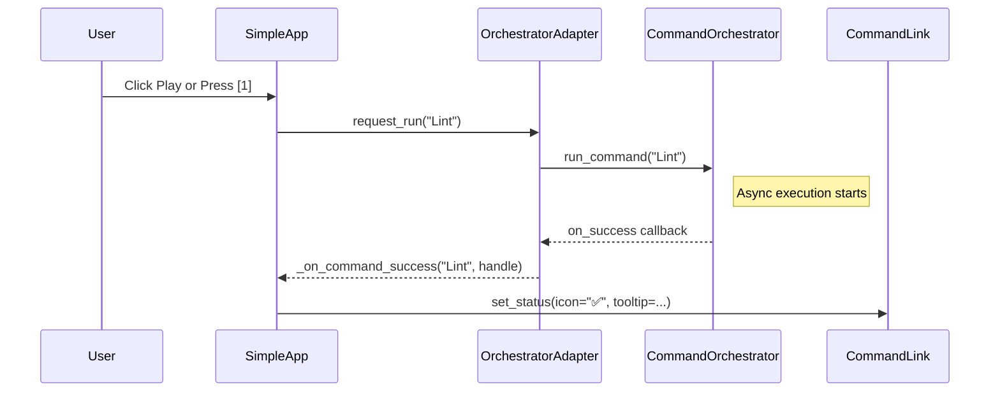
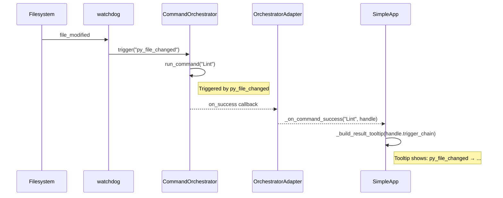

# textual-cmdorc Architecture - Simplified Design
**Version:** 0.2.0 (Simplified)  
**Status:** Authoritative design document

This document describes the simplified architecture of `textual-cmdorc` after removing hierarchical display complexity.

---

## 1. Design Principles

| Principle | Rationale |
|-----------|-----------|
| **Simplicity first** | Flat list instead of tree - easier to understand and maintain |
| **Direct event handling** | No wrapper widgets, no complex indirection - just CommandLink + callbacks |
| **cmdorc is the source of truth** | All state lives in CommandOrchestrator, TUI is purely reactive |
| **Rich tooltips** | All context (triggers, chains, history) visible without tree navigation |
| **Separation of concerns** | Config (cmdorc_frontend) vs UI (textual_cmdorc) |
| **Reusable backend** | OrchestratorAdapter is non-Textual, usable by other frontends |
| **No polling** | All updates driven by explicit callbacks from cmdorc |

---

## 2. Three-Layer Architecture

```
┌──────────────────────────────────────────────────────┐
│  SimpleApp (Textual App)                             │
│  - Flat list of commands in TOML order              │
│  - Direct CommandLink event handlers                │
│  - Three tooltip states: idle/running/result        │
│  - Global keyboard shortcuts from config            │
└──────────────────────────────────────────────────────┘
                      │ uses
                      ▼
┌──────────────────────────────────────────────────────┐
│  OrchestratorAdapter (Non-Textual)                   │
│  - Loads config, creates CommandOrchestrator         │
│  - Lifecycle callback registration                   │
│  - Sync-safe command execution (request_run/cancel) │
│  - Keyboard config access                            │
└──────────────────────────────────────────────────────┘
                      │ uses
                      ▼
┌──────────────────────────────────────────────────────┐
│  cmdorc_frontend (Shared Backend)                    │
│  - Config parsing (TOML → models)                    │
│  - TriggerSource (semantic summaries)                │
│  - CommandNode hierarchy (for future use)            │
│  - File watcher configs                              │
└──────────────────────────────────────────────────────┘
```

### Responsibilities Table

| Component | Owns | Does NOT Own |
|-----------|------|--------------|
| **SimpleApp** | Layout, event handlers, tooltips, keyboard bindings | State, execution, config |
| **OrchestratorAdapter** | Orchestrator, callbacks, keyboard config | UI rendering, Textual lifecycle |
| **cmdorc_frontend** | Config parsing, models, hierarchy building | UI, execution, callbacks |

---

## 3. Data Flow

### 3.1 Startup Sequence

```
User
  └──> SimpleApp.__init__(config_path)
         ├──> compose()
         │     ├──> OrchestratorAdapter.__init__(config_path)
         │     │     ├──> load_config() → CommandOrchestrator
         │     │     └──> load_frontend_config() → keyboard_config, watchers, hierarchy
         │     │
         │     └──> FileLinkList()
         │           └──> CommandLink() × N (in TOML order)
         │
         └──> on_mount()
               ├──> adapter.attach(loop)
               ├──> Wire lifecycle callbacks (success/failed/cancelled)
               └──> Bind global keyboard shortcuts
```

### 3.2 Command Execution Flow



### 3.3 File Watcher Flow



---

## 4. Key Classes

### `textual_cmdorc/simple_app.py`

```python
class SimpleApp(App):
    """Simplified TUI - flat list, direct event handlers."""
    
    # Composition
    adapter: OrchestratorAdapter
    file_list: FileLinkList  # Container for CommandLinks
    
    # State
    running_commands: set[str]  # Track which commands are running
    
    # Lifecycle
    def compose(self) -> ComposeResult:
        """Build flat list of CommandLinks in TOML order."""
    
    async def on_mount(self) -> None:
        """Attach adapter, wire callbacks, bind keyboard shortcuts."""
    
    # Tooltip builders
    def _build_idle_tooltip(self, cmd_name: str) -> str:
        """Triggers: X, Y, manual\n[1] to run"""
    
    def _build_running_tooltip(self, cmd_name: str, handle: RunHandle) -> str:
        """Stop — Ran automatically (file change)\npy_file_changed\n[1] to stop"""
    
    def _build_result_tooltip(self, cmd_name: str, handle: RunHandle) -> str:
        """Last run: X → Y (✅ 2s ago)\nDuration: 1.5s\n[1] to run again"""
    
    # Message handlers
    def on_command_link_play_clicked(self, event): ...
    def on_command_link_stop_clicked(self, event): ...
    def on_command_link_settings_clicked(self, event): ...
    
    # Lifecycle callbacks (from OrchestratorAdapter)
    def _on_command_success(self, name: str, handle: RunHandle): ...
    def _on_command_failed(self, name: str, handle: RunHandle): ...
    def _on_command_cancelled(self, name: str, handle: RunHandle): ...
    
    # Actions
    async def action_toggle_command(self, cmd_name: str): ...
    async def action_reload_config(self): ...
    def action_show_help(self): ...
```

### `cmdorc_frontend/orchestrator_adapter.py`

```python
class OrchestratorAdapter:
    """Non-Textual adapter for CommandOrchestrator.
    
    Primary API for any frontend (TUI, VSCode, web, etc.)
    """
    
    orchestrator: CommandOrchestrator
    keyboard_config: KeyboardConfig
    
    # Lifecycle
    def attach(self, loop: asyncio.AbstractEventLoop): ...
    def detach(self): ...
    
    # Command execution (async)
    async def run_command(self, name: str, vars: dict | None = None) -> RunHandle: ...
    async def cancel_command(self, name: str) -> int: ...
    
    # Command execution (sync-safe for UI callbacks)
    def request_run(self, name: str): ...
    def request_cancel(self, name: str): ...
    
    # Callback registration
    def on_command_success(self, name: str, callback: Callable): ...
    def on_command_failed(self, name: str, callback: Callable): ...
    def on_command_cancelled(self, name: str, callback: Callable): ...
    
    # Queries
    def get_command_names(self) -> list[str]:  # In TOML order
    def get_keyboard_shortcuts(self) -> dict[str, str]: ...
```

### `cmdorc_frontend/models.py`

```python
@dataclass
class TriggerSource:
    """Represents trigger chain that caused a command to run."""
    name: str  # Last trigger
    kind: Literal["manual", "file", "lifecycle"]
    chain: list[str]  # Full chain
    
    @classmethod
    def from_trigger_chain(cls, trigger_chain: list[str]) -> "TriggerSource": ...
    
    def get_semantic_summary(self) -> str:
        """'Ran manually' / 'Ran automatically (file change)' / ..."""
    
    def format_chain(self, separator: str = " → ", max_width: int = 80) -> str:
        """Format chain with optional left truncation."""

@dataclass
class CommandNode:
    """Hierarchical node (built but not used by TUI - for future frontends)."""
    config: CommandConfig
    children: list["CommandNode"]

@dataclass
class KeyboardConfig:
    """Keyboard shortcut configuration."""
    shortcuts: dict[str, str]  # command_name -> key
    enabled: bool
    show_in_tooltips: bool
```

---

## 5. Configuration

### TOML Structure

```toml
[variables]
base_dir = "."

[[file_watcher]]
dir = "."
patterns = ["**/*.py"]
trigger = "py_file_changed"
debounce_ms = 300

[[command]]
name = "Lint"
command = "ruff check ."
triggers = ["py_file_changed"]

[[command]]
name = "Format"
command = "ruff format ."
triggers = ["command_success:Lint"]

[[command]]
name = "Tests"
command = "pytest {{ base_dir }}"
triggers = ["command_success:Format"]

[keyboard]
shortcuts = { Lint = "1", Format = "2", Tests = "3" }
enabled = true
show_in_tooltips = true
```

### Loading Process

```python
# 1. Load runner config (for cmdorc)
runner_config = load_config(path)  # From cmdorc library

# 2. Load frontend config
runner_config, keyboard_config, watchers, hierarchy = load_frontend_config(path)

# 3. Create orchestrator
orchestrator = CommandOrchestrator(runner_config)

# 4. Build hierarchy (for future use, not displayed in TUI)
hierarchy: list[CommandNode]  # Tree structure
```

---

## 6. Tooltip States

### Idle (Not Running)
```
Lint
Triggers: py_file_changed, manual
[1] to run
```

**Content:**
- Command name (from config)
- All configured triggers (static)
- Keyboard shortcut (if configured)

### Running
```
Stop — Ran automatically (file change)
py_file_changed
[1] to stop
```

**Content:**
- Semantic summary (from TriggerSource.kind)
- Full trigger chain (formatted)
- Keyboard shortcut to stop

### Result (Success)
```
Last run: py_file_changed (✅ 2s ago)
Duration: 1.5s
[1] to run again
```

**Content:**
- Last trigger chain with status emoji
- Relative timestamp (Xs ago, Xm ago, Xh ago)
- Duration
- Keyboard shortcut to run again

### Result (Failed)
```
Last run: manual (❌ 30s ago)
Duration: 450ms
[2] to run again
```

### Result (Cancelled)
```
Last run: py_file_changed → command_success:Lint (⚠️ 1m ago)
Duration: 2.3s
[1] to run again
```

### Config Error
```
⚠️ Config error: Command 'Lint' references unknown trigger 'nonexistent'
```

---

## 7. Keyboard Shortcuts

### Global Bindings (From Config)

```python
# Bind from [keyboard] section
[keyboard]
shortcuts = { Lint = "1", Format = "2", Tests = "3" }
```

**Behavior:**
- Key toggles command (play if idle, stop if running)
- Valid keys: 1-9, a-z, f1-f12
- Invalid keys logged and ignored
- Shortcuts shown in tooltips if `show_in_tooltips = true`

### App Bindings (Built-in)

| Key | Action | Description |
|-----|--------|-------------|
| h | show_help | Show modal help screen with shortcuts |
| r | reload_config | Reload config, rebuild list (drops history) |
| q | quit | Exit application |

### Help Screen

Modal screen showing:
- Command shortcuts (from config)
- App shortcuts (built-in)
- Press ESC to close

---

## 8. Testing Strategy

### Unit Tests (cmdorc_frontend)
- Config parsing (TOML → models)
- TriggerSource.format_chain() with truncation
- TriggerSource.get_semantic_summary()
- Hierarchy building (cycle detection)

### Integration Tests (textual_cmdorc)
- OrchestratorAdapter lifecycle (attach/detach)
- Callback wiring (success/failed/cancelled)
- Sync-safe execution (request_run/cancel)
- Keyboard shortcut binding

### UI Tests (Textual test utilities)
- CommandLink play/stop/settings clicks
- Tooltip updates on state changes
- Keyboard shortcut actions
- Help screen display
- Config reload

### Manual Testing Checklist
See [implementation_plan.md](implementation_plan.md#testing-checklist)

---

## 9. Removed Features (vs Old Design)

| Feature | Status | Notes |
|---------|--------|-------|
| Hierarchical tree | ❌ Removed | Flat list instead |
| Duplicate tracking | ❌ Removed | No longer needed (flat list) |
| CmdorcCommandLink wrapper | ❌ Removed | Use textual-filelink's CommandLink directly |
| CmdorcController | ❌ Removed | OrchestratorAdapter is simpler |
| CmdorcView | ❌ Removed | Use FileLinkList directly |
| Log pane | ❌ Removed | May add later |
| State reconciliation | ❌ Removed | No persistence (for now) |

---

## 10. Future Enhancements

### Planned
- [ ] Log pane (toggle with 'l' key)
- [ ] State persistence (resume running commands)
- [ ] Settings submenu (configure command on fly)
- [ ] Alternate tree view (toggle flat/tree display)
- [ ] Output file viewer (click command name to view logs)

### Maybe Later
- [ ] Command search/filter
- [ ] Command groups/tags
- [ ] Visual graph of trigger relationships
- [ ] Export history to JSON
- [ ] Notification on command completion

---

## 11. Extension Points

### For Other Frontends (e.g., VSCode)

**Reusable Components:**
- `OrchestratorAdapter` - Backend interface (no Textual dependency)
- `cmdorc_frontend/*` - Config parsing, models, hierarchy building
- `TriggerSource` - Semantic summaries and chain formatting

**VSCode Extension Could:**
- Use OrchestratorAdapter for command execution
- Display hierarchy in tree view (using CommandNode)
- Show trigger chains in hover tooltips
- Reuse keyboard config for keybindings

**Example:**
```python
# In VSCode extension
from cmdorc_frontend import OrchestratorAdapter, TriggerSource

adapter = OrchestratorAdapter("config.toml")
loop = asyncio.get_event_loop()
adapter.attach(loop)

# Wire to VSCode output panel
adapter.on_command_success("Build", lambda h: show_success(h))
adapter.on_command_failed("Build", lambda h: show_error(h))

# Execute from command palette
await adapter.run_command("Build")
```

---

## 12. Invariants

1. **cmdorc is source of truth** - TUI never infers state, only reflects cmdorc's state transitions
2. **No polling** - All updates driven by explicit callbacks
3. **Idempotent callbacks** - Multiple calls with same state should be safe
4. **TOML order preserved** - Commands displayed in config appearance order
5. **Trigger chains immutable** - Once set, RunHandle.trigger_chain never changes
6. **Keyboard shortcuts optional** - App works without [keyboard] section

---

## 13. Benefits of Simplified Design

### Code Quality
- 75% less code (~500 lines vs ~2000)
- No complex state synchronization
- Clear message flow
- Easy to debug

### User Experience
- Predictable order (matches config)
- Rich tooltips (no tree navigation needed)
- Fast config reload
- Keyboard shortcuts discoverable

### Maintainability
- Single responsibility per component
- No wrapper layers
- Stable OrchestratorAdapter API
- Easy to add features

### Performance
- No tree rebuilding on updates
- Simpler widget hierarchy
- Fewer Textual messages

---

## Appendix: Migration from Old Design

### API Changes

| Old | New | Notes |
|-----|-----|-------|
| CmdorcApp | SimpleApp | Simplified, no controller layer |
| CmdorcController | OrchestratorAdapter | Non-Textual, reusable |
| CmdorcView | FileLinkList | Direct Textual widget |
| CmdorcCommandLink | CommandLink | Use textual-filelink directly |
| Tree display | Flat list | Hierarchy still built (for future) |

### Config Changes

**No breaking changes** - All TOML config compatible with old design.

### Behavior Changes

- Commands appear in TOML order (not tree hierarchy)
- No duplicate indicators (commands only appear once)
- No log pane (for now)
- Tooltips show more detail (trigger chains, history)
- Config reload drops history (no persistence yet)

---

## Document History

- **v0.1.0** - Original embeddable architecture with tree display
- **v0.2.0** - Simplified flat list design (current)